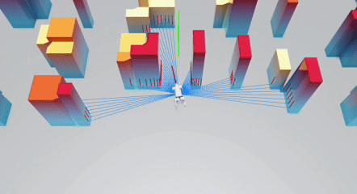
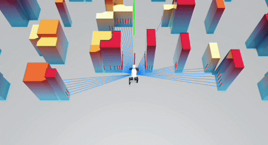
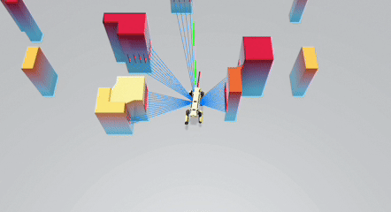
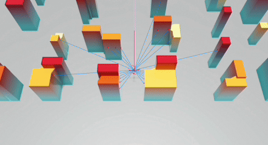
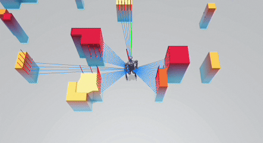
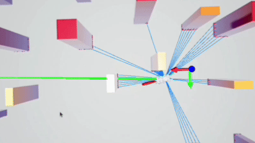
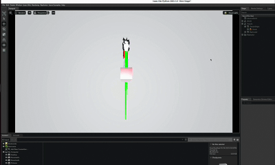

# CE-Nav: Flow-Guided Reinforcement Refinement for Cross-Embodiment Local Navigation

<p align="center">
  <a href="https://arxiv.org/abs/2509.23203">
    
  </a>
  <a href="https://ce-nav.github.io/">
    
  </a>
</p>

CE-Nav is a learning-based, generalizable local navigation framework for robots. It features a novel two-stage (Imitation Learning-then-Reinforcement Learning) methodology that systematically decouples universal geometric reasoning from embodiment-specific dynamic adaptation, enabling efficient policy transfer across diverse robot morphologies including quadrupeds, bipeds, and quadrotors.

## Cross-Embodiment Navigation

<table align="center">
  <tr>
    <td align="center"><b>Go2</b></td>
    <td align="center"><b>MagicDog</b></td>
    <td align="center"><b>Spot</b></td>
  </tr>
  <tr>
    <td align="center"></td>
    <td align="center"></td>
    <td align="center"></td>
  </tr>
</table>

<table align="center">
  <tr>
    <td align="center"><b>Hummingbird</b></td>
    <td align="center"><b>H1</b></td>
  </tr>
  <tr>
    <td align="center"></td>
    <td align="center"></td>
  </tr>
</table>

## VelFlow: Multi-Modal Velocity Planning

<table align="center">
  <tr>
    <td align="center"></td>
    <td align="center"></td>
  </tr>
</table>

## TODO List

**Completed:**

- [x] **Cross-Embodiment Evaluation Framework** - Unified evaluation methods for different robot platforms
- [x] **VelFlow Expert Model Checkpoint** - Pre-trained General Expert model
- [x] **Go2 Model Checkpoint** - Trained policy checkpoint for Unitree Go2 quadruped
- [x] **VelFlow Expert Training Code** - Imitation-learning pipeline for the General Expert model
- [x] **Go2 Training Code** - Reinforcement-learning refinement scripts for Unitree Go2 quadruped

Stay tuned for updates!

## Installation

### Prerequisites

- NVIDIA GPU with CUDA support
- Ubuntu 20.04 / 22.04
- [Conda](https://docs.anaconda.com/miniconda/)

### Isaac Sim Installation

This project requires **Isaac Sim version 2023.1.0-hotfix.1**. Please ensure you download this exact version.

**Step 1:** Follow the [Docker Container Setup](https://docs.isaacsim.omniverse.nvidia.com/latest/installation/install_container.html).

**Step 2:** Download Isaac Sim to your docker container:

```bash
docker pull nvcr.io/nvidia/isaac-sim:2023.1.0-hotfix.1

docker run --name isaac-sim --entrypoint bash -it --runtime=nvidia --gpus all -e "ACCEPT_EULA=Y" --rm --network=host \
    -e "PRIVACY_CONSENT=Y" \
    -v ~/docker/isaac-sim/cache/kit:/isaac-sim/kit/cache:rw \
    -v ~/docker/isaac-sim/cache/ov:/root/.cache/ov:rw \
    -v ~/docker/isaac-sim/cache/pip:/root/.cache/pip:rw \
    -v ~/docker/isaac-sim/cache/glcache:/root/.cache/nvidia/GLCache:rw \
    -v ~/docker/isaac-sim/cache/computecache:/root/.nv/ComputeCache:rw \
    -v ~/docker/isaac-sim/logs:/root/.nvidia-omniverse/logs:rw \
    -v ~/docker/isaac-sim/data:/root/.local/share/ov/data:rw \
    -v ~/docker/isaac-sim/documents:/root/Documents:rw \
    nvcr.io/nvidia/isaac-sim:2023.1.0-hotfix.1
```

**Step 3:** Move the downloaded Isaac Sim from the docker container to your local machine:

```bash
docker ps  # Check your container ID in another terminal

# Replace <id_container> with the output from the previous command
docker cp <id_container>:/isaac-sim /path/to/local/folder  # Use absolute path
```

### CE-Nav Setup

Clone the repository and set up the environment:

```bash
# Set the ISAACSIM_PATH environment variable
echo 'export ISAACSIM_PATH="/path/to/isaac_sim-2023.1.0-hotfix.1"' >> ~/.bashrc
source ~/.bashrc

# Navigate to the isaac-training directory
cd CE-Nav/isaac-training

# Run the setup script
bash setup.sh
```

After the setup completes, you should have created a virtual environment named `cenav`.

### Verify Installation

```bash
# Activate the environment
conda activate cenav

# Run evaluation to verify installation
cd training/scripts
python eval.py
```

If the installation is correct, you should see the Isaac Sim window open with the Go2 robot and obstacles.

## Usage

### Evaluation

Modify `isaac-training/training/cfg/eval.yaml` to configure the evaluation mode:

**Dynamics-Aware Refiner Policy (Recommended):**

```yaml
evaluation:
  mode: guided_student
  expert_cnfm_model_path: "../../../il_training/fastsys/checkpoints/dynfji91/best_model.pt"
  student_checkpoint: "ckpts/checkpoint_7500.pt"
```

**General Expert (VelFlow) Model:**

```yaml
evaluation:
  mode: expert_cnfm
  expert_cnfm_model_path: "../../../il_training/fastsys/checkpoints/dynfji91/best_model.pt"
```

**Run Evaluation:**

```bash
conda activate cenav
cd isaac-training/training/scripts
python eval.py
```

### Training

CE-Nav is trained in two stages: (1) imitation learning to obtain the embodiment-agnostic VelFlow expert, then (2) reinforcement learning to refine it for a specific robot.

#### Stage 1 — VelFlow Expert (Imitation Learning)

The VelFlow expert is trained by imitating a DWA motion planner in procedurally-generated obstacle scenarios. Each demonstration is an `.npz` sample with keys `state` (6,), `target` (2,), `obstacle` (127x127 occupancy grid), and `action` (3,).

**(a) Generate expert demonstrations** (optional — skip if you already have a dataset):

```bash
conda activate cenav
cd il_training/fastsys
# eval.py's main() defaults to mode='dwa': it runs the DWA planner and
# saves .npz samples under eval_results/
python eval.py
```

**(b) Point the config at your dataset** — edit `il_training/fastsys/config_navrl_il.yaml`:

```yaml
data:
  train_dir: "./eval_results"   # directory of training .npz files
  test_dir:  "./eval_results"   # directory of test .npz files (use a separate split for proper evaluation)
```

**(c) Train the flow policy:**

```bash
cd il_training/fastsys
python train_navrl_il.py
```

Checkpoints are written to `checkpoints/<run_id>/`; the best model is selected by in-loop DWA evaluation and saved as `best_model.pt`.

#### Stage 2 — Embodiment Refinement (Reinforcement Learning)

The RL stage loads the frozen VelFlow expert as an imitation reference and refines the policy for a specific embodiment (e.g., Go2) in Isaac Sim.

```bash
conda activate cenav
cd isaac-training/training/scripts
python train.py
```

Training uses `cfg/train.yaml` (composed with `ppo.yaml`, `radar.yaml`, `sim.yaml`). The IL expert checkpoint `il_training/fastsys/checkpoints/dynfji91/best_model.pt` is loaded as the reference.

## Citation

If you use CE-Nav in your research, please cite our paper:

```bibtex
@article{yang2025cenav,
  title={{CE-Nav: Flow-Guided Reinforcement Refinement for Cross-Embodiment Local Navigation}},
  author={Yang, Kai and Zhang, Tianlin and Wang, Zhengbo and Chu, Zedong and Wu, Xiaolong and Cai, Yang and Xu, Mu},
  journal={arXiv preprint arXiv:2509.23203},
  year={2025},
  eprint={2509.23203},
  archivePrefix={arXiv},
  primaryClass={cs.RO}
}
```

## License

This project is licensed under the MIT License - see the [LICENSE](LICENSE) file for details.

## Acknowledgments

This project builds upon several excellent frameworks. We are particularly grateful to:

- [NavRL](https://github.com/Zhefan-Xu/NavRL) - The Isaac Sim training component of our framework is built upon NavRL
- [Isaac Sim](https://developer.nvidia.com/isaac-sim) - NVIDIA's robotics simulation platform
- [Orbit](https://github.com/NVIDIA-Omniverse/Orbit) - Robot learning framework
- [OmniDrones](https://github.com/btx0424/OmniDrones) - Drone simulation framework
- [TorchRL](https://github.com/pytorch/rl) - PyTorch reinforcement learning library
- [Unitree Robotics](https://www.unitree.com/) - Go2 quadruped robot
