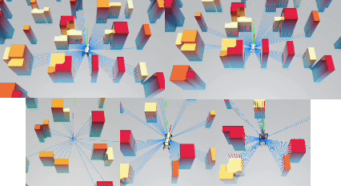

# CE-Nav: Flow-Guided Reinforcement Refinement for Cross-Embodiment Local Navigation

CE-Nav is a learning-based, generalizable local navigation framework for robots operating in complex environments. At its core, CE-Nav features a novel two-stage (Imitation Learning-then-Reinforcement Learning) methodology that systematically decouples universal geometric reasoning from embodiment-specific dynamic adaptation.

The framework first trains a multi-modal, embodiment-agnostic **General Expert** (named **VelFlow**) offline, which learns from a large-scale dataset generated by a classical planner, completely avoiding the need for real robot data. Subsequently, for a new robot, this expert acts as a guiding prior to rapidly train a lightweight **Dynamics-Aware Refiner** via online reinforcement learning. This allows the policy to be efficiently adapted to a wide variety of robotic platforms.

This repository currently provides the evaluation code for the **Unitree Go2** robot within the Isaac Sim environment. The training scripts and code for other robot platforms will be updated soon.

## Demo

Watch our overview demonstration:

<div align="center">
  
</div>

### Robot Demonstrations

Our framework has been successfully deployed on various robotic platforms:

<table>
  <tr>
    <td align="center"><b>Go2</b></td>
    <td align="center"><b>H1</b></td>
  </tr>
  <tr>
    <td align="center">
      <video src="media/go2.mp4" width="100%" controls/>
    </td>
    <td align="center">
      <video src="media/h1.mp4" width="100%" controls/>
    </td>
  </tr>
</table>

<table>
  <tr>
    <td align="center"><b>Hummingbird</b></td>
    <td align="center"><b>MagicDog</b></td>
    <td align="center"><b>Spot</b></td>
  </tr>
  <tr>
    <td align="center">
      <video src="media/hb.mp4" width="100%" controls/>
    </td>
    <td align="center">
      <video src="media/magic.mp4" width="100%" controls/>
    </td>
    <td align="center">
      <video src="media/spot.mp4" width="100%" controls/>
    </td>
  </tr>
</table>

## Framework Overview

CE-Nav is designed to overcome the key challenges in generalizing navigation policies across diverse robot morphologies. It addresses issues like the tight coupling of planning and control, the need for costly embodiment-specific data, and the "disastrous averaging" problem where deterministic models fail to capture multi-modal decisions (e.g., turning left or right).

Our framework is divided into two distinct stages:

  - **Stage 1: Offline Training of the General Expert (VelFlow)**

      - We use imitation learning to train an **embodiment-agnostic** expert policy, **VelFlow**.
      - VelFlow is a Conditional Normalizing Flow Model (CNFM) that learns the full distribution of kinematically-sound actions from a classical planner (DWA), thereby avoiding any reliance on real robot data.
      - By capturing the multi-modal distribution of expert actions, VelFlow effectively resolves the "disastrous averaging" issue, preventing the policy from generating ineffective, averaged-out commands in ambiguous situations.

  - **Stage 2: Online Training of the Dynamics-Aware Refiner**

      - For a new robot, the pre-trained General Expert is frozen and used as a guiding prior.
      - A lightweight refiner module is trained quickly through online reinforcement learning (PPO) with minimal environmental interaction.
      - This refiner learns to compensate for the target robot's specific dynamics and the imperfections of its low-level controller, translating the expert's general plan into dynamically feasible and optimal commands for that specific embodiment.

## Key Features

  - **Cross-Embodiment Generalization**: The framework has been successfully validated on a wide range of robots with vastly different morphologies and dynamics, including:
      - **Quadrupeds**: Unitree Go2, MagicDog, Spot
      - **Bipeds**: Unitree H1
      - **Quadrotors**: Hummingbird
  - **Two-Stage Decoupled Learning (IL-then-RL)**: Elegantly separates universal geometric reasoning from embodiment-specific dynamics, enhancing transferability and efficiency.
  - **Multi-Modal Action Modeling**: Leverages a flow-based model (**VelFlow**) to capture the full distribution of expert actions, fundamentally solving the "disastrous averaging" problem seen in deterministic models.
  - **Zero-Shot Real Robot Data**: The General Expert is trained entirely offline on data from a classical planner, eliminating the need to collect expensive and biased real-world robot trajectories.
  - **Rapid and Efficient Adaptation**: Adapting the policy to a new robot is remarkably fast, requiring only the training of a lightweight refiner (approx. 6 hours in our experiments), which drastically reduces deployment costs.
  - **Proven Sim-to-Real Transfer**: Successfully deployed on real-world Unitree Go2 and MagicDog robots, demonstrating state-of-the-art performance in real-world navigation scenarios.

## Installation

### Isaac Sim Installation

To download Isaac Sim version 2023.1.0-hotfix.1:

a. First, follow the steps on [this link](https://docs.isaacsim.omniverse.nvidia.com/latest/installation/install_container.html) to complete the Docker Container Setup.

b. Then, download the Isaac Sim to your docker container:

```bash
docker pull nvcr.io/nvidia/isaac-sim:2023.1.0-hotfix.1

docker run --name isaac-sim --entrypoint bash -it --runtime=nvidia --gpus all -e "ACCEPT_EULA=Y" --rm --network=host \
    -e "PRIVACY_CONSENT=Y" \
    -v ~/docker/isaac-sim/cache/kit:/isaac-sim/kit/cache:rw \
    -v ~/docker/isaac-sim/cache/ov:/root/.cache/ov:rw \
    -v ~/docker/isaac-sim/cache/pip:/root/.cache/pip:rw \
    -v ~/docker/isaac-sim/cache/glcache:/root/.cache/nvidia/GLCache:rw \
    -v ~/docker/isaac-sim/cache/computecache:/root/.nv/ComputeCache:rw \
    -v ~/docker/isaac-sim/logs:/root/.nvidia-omniverse/logs:rw \
    -v ~/docker/isaac-sim/data:/root/.local/share/ov/data:rw \
    -v ~/docker/isaac-sim/documents:/root/Documents:rw \
    nvcr.io/nvidia/isaac-sim:2023.1.0-hotfix.1
```

c. Move the downloaded Isaac Sim from the docker container to your local machine:

```bash
docker ps  # Check your container ID in another terminal

# Replace <id_container> with the output from the previous command
docker cp <id_container>:/isaac-sim /path/to/local/folder  # Use absolute path
```

Isaac Sim version 2023.1.0-hotfix.1 is now installed on your local machine.

### CE-Nav Framework Setup

Clone the repository and set up the environment (this process may take several minutes):

```bash
# Set the ISAACSIM_PATH environment variable
echo 'export ISAACSIM_PATH="/path/to/isaac_sim-2023.1.0-hotfix.1"' >> ~/.bashrc
source ~/.bashrc

# Navigate to the isaac-training directory
cd CE-Nav/isaac-training

# Run the setup script
bash setup.sh
```

After the setup completes, you should have created a virtual environment named `cenav`.

### Verify Installation

Activate the environment and run a verification test:

```bash
# Activate the environment
conda activate cenav

# Run evaluation to verify installation
cd training/scripts
python eval.py
```

If the installation is correct, you should see the Isaac Sim window open with the Go2 robot and obstacles.

## Usage

### Evaluation

The evaluation system supports assessing both the final refined policy and the General Expert model directly.

#### Evaluation Modes

Modify `isaac-training/training/cfg/eval.yaml` to configure the evaluation mode:

**1. Dynamics-Aware Refiner Policy (Recommended)**

Evaluate the final policy trained with VelFlow expert guidance:

```yaml
evaluation:
  mode: guided_student
  expert_cnfm_model_path: "../../../il_training/fastsys/checkpoints/dynfji91/best_model.pt"
  student_checkpoint: "ckpts/checkpoint_7500.pt"
```

**2. General Expert (VelFlow) Model**

Directly evaluate the VelFlow expert model's performance without the refiner:

```yaml
evaluation:
  mode: expert_cnfm
  expert_cnfm_model_path: "../../../il_training/fastsys/checkpoints/dynfji91/best_model.pt"
```

#### Running Evaluation

```bash
conda activate cenav
cd isaac-training/training/scripts
python eval.py
```

... (The rest of the sections: `Evaluation Types`, `Evaluation Metrics`, `Training`, `Configuration`, etc., can remain as you provided as they are implementation-specific.)

## TODO List

**Completed:**

- [x] **Cross-Embodiment Evaluation Framework** - Unified evaluation methods for different robot platforms
- [x] **VelFlow Expert Model Checkpoint** - Pre-trained General Expert model
- [x] **Go2 Model Checkpoint** - Trained policy checkpoint for Unitree Go2 quadruped

**Upcoming Releases:**

We are actively working on releasing additional code:

- [ ] **VelFlow Expert Training Code** - General Expert model training pipeline
- [ ] **Go2 Training Code** - Complete training scripts for Unitree Go2 quadruped

Stay tuned for updates!

## Citation

If you use CE-Nav in your research, please cite our paper:

```bibtex
@article{yang2025cenav,
  title={{CE-Nav: Flow-Guided Reinforcement Refinement for Cross-Embodiment Local Navigation}},
  author={Yang, Kai and Zhang, Tianlin and Wang, Zhengbo and Chu, Zedong and Wu, Xiaolong and Cai, Yang and Xu, Mu},
  journal={arXiv preprint arXiv:2509.23203},
  year={2025},
  eprint={2509.23203},
  archivePrefix={arXiv},
  primaryClass={cs.RO}
}
```

## License

This project is licensed under the MIT License - see the [LICENSE](https://www.google.com/search?q=LICENSE) file for details.

## Acknowledgments

This project builds upon several excellent frameworks and was developed within the Isaac Sim simulation environment. We are particularly grateful to the following projects:

  - [NavRL](https://github.com/Zhefan-Xu/NavRL) - The Isaac Sim training component of our framework is built upon NavRL
  - [Isaac Sim](https://developer.nvidia.com/isaac-sim) - NVIDIA's robotics simulation platform
  - [Orbit](https://github.com/NVIDIA-Omniverse/Orbit) - Robot learning framework
  - [OmniDrones](https://github.com/btx0424/OmniDrones) - Drone simulation framework
  - [TorchRL](https://github.com/pytorch/rl) - PyTorch reinforcement learning library
  - [Unitree Robotics](https://www.unitree.com/) - Go2 quadruped robot